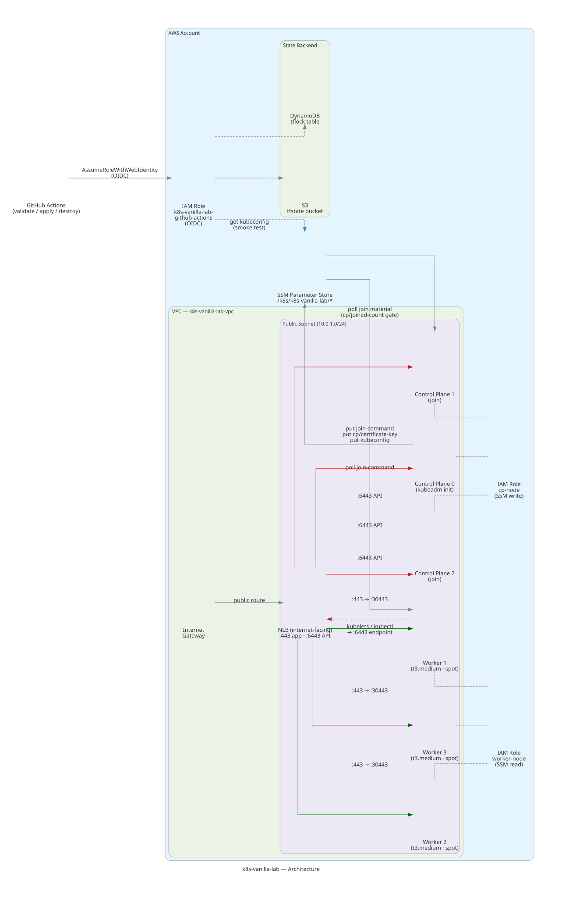

# k8s-vanilla-lab

Kubernetes 1.35 bootstrapped with kubeadm on AWS EC2, automated with OpenTofu and cloud-init.

> **Status:** experimental · learning in public · not for production

[](https://github.com/jmcj-labs/k8s-vanilla-lab/actions/workflows/validate.yml)
[](LICENSE)
[](https://opentofu.org)
[](https://kubernetes.io)
[](https://pre-commit.com)

---

## Architecture



| Component | Role |
|-----------|------|
| Control plane (t3.medium, on-demand) | kubeadm init (kube-proxy-free), etcd, API server, Elastic IP |
| Worker nodes × 2 (t3.medium, spot) | kubelet (with `--provider-id`), containerd, Cilium agent |
| Cilium (kube-proxy replacement) | eBPF datapath, Service routing (no kube-proxy), Gateway API, Hubble |
| Platform layer (`platform/`) | EBS CSI + gp3 default SC, cert-manager, shared Gateway, CNPG + Strimzi operators, kube-prometheus-stack |
| Internet Gateway + public subnet | Single public subnet, no NAT gateway |
| SSM Parameter Store | Join token, CA cert hash, kubeconfig distribution |
| GitHub Actions (OIDC) | Validate, apply (+ platform + smoke), destroy — no long-lived credentials |
| S3 + DynamoDB | Remote state backend and lock table |

Workers run on spot to keep monthly cost at ~$36. The control plane runs on-demand so the API
server and etcd are never interrupted by spot reclamations. See
[ADR-002](docs/decisions/ADR-002-spot-workers-ondemand-cp.md) for the cost breakdown.

---

## What gets deployed

| Component | Version | Purpose |
|-----------|---------|---------|
| Kubernetes | 1.35.x (latest patch) | Orchestration platform |
| containerd | latest from Docker repo (2.3.x) | Container runtime (CRI) |
| kubeadm / kubelet / kubectl | 1.35.x (latest patch) | Cluster bootstrap and node management |
| Cilium | v1.19.6 | eBPF CNI, **strict kube-proxy replacement**, Gateway API, Hubble |
| kube-proxy | — | **Not installed** (`skipPhases: addon/kube-proxy`) |
| Gateway API CRDs | v1.2.1 | Standard install, applied before Cilium |
| Ubuntu | 24.04 LTS | Base OS |
| OpenTofu | 1.8.0 | Infrastructure as Code |

Platform layer (installed by `make platform` — see [platform/README.md](platform/README.md)):

| Component | Chart | Purpose |
|-----------|-------|---------|
| EBS CSI driver | 2.63.1 | Dynamic volumes; `gp3` default StorageClass (encrypted, WaitForFirstConsumer) |
| cert-manager | v1.21.1 | Certificates; `selfsigned` ClusterIssuer, Gateway API integration |
| Shared Gateway | — | `infra/shared-gw`: HTTPS :443, `*.logistics.lab`, routes from ns `logistics` |
| CloudNativePG | 0.29.0 | PostgreSQL operator (ns `data`, operator only) |
| Strimzi | 1.1.0 | Kafka operator (ns `data`, operator only) |
| kube-prometheus-stack | 88.2.0 | Monitoring; Grafana on NodePort, Alertmanager off |

Deployment runs in four sequential stages:

| Stage | What happens | Duration |
|-------|-------------|----------|
| 1 — Common bootstrap | containerd, kubeadm, kubelet (with `--provider-id` from IMDSv2), AWS CLI on all nodes | 3-5 min |
| 2 — Control plane init | `kubeadm init` (no kube-proxy), Gateway API CRDs, Cilium KPR, join data + kubeconfig in SSM | 5-7 min |
| 3 — Workers join | Workers poll SSM, run `kubeadm join` | 2-3 min |
| 4 — Platform | `make platform` (automatic in the CI apply workflow) | 5-10 min |

Total: 8-12 minutes of bootstrap after `make apply`, then the platform pass.

---

## Prerequisites

| Tool | Version | Install |
|------|---------|---------|
| OpenTofu | >= 1.8.0 | [opentofu.org/docs/intro/install](https://opentofu.org/docs/intro/install/) |
| kubectl | any | [kubernetes.io/docs/tasks/tools](https://kubernetes.io/docs/tasks/tools/) |
| AWS CLI | v2 | [aws.amazon.com/cli](https://aws.amazon.com/cli/) |

AWS one-time setup (S3 state bucket, DynamoDB lock table, OIDC provider, IAM role):
see [docs/bootstrap.md](docs/bootstrap.md).

---

## Quickstart

```bash
# 1. One-time AWS setup (idempotent — safe to re-run)
make bootstrap-aws

# 2. Configure
cp tofu/envs/lab/terraform.tfvars.example tofu/envs/lab/terraform.tfvars
# edit: my_ip (curl ifconfig.me), ssh_key_name, aws_region
cp tofu/envs/lab/backend.hcl.example tofu/envs/lab/backend.hcl
# edit: bucket, region, dynamodb_table

# 3. Deploy (8-12 min for bootstrap to complete)
make init
make apply

# 4. Install the platform layer (EBS CSI, cert-manager, Gateway, operators, monitoring)
make platform

# 5. Verify everything (nodes, KPR, providerID, PVC, Gateway, operators)
make smoke-test

# 6. Fetch kubeconfig from SSM and connect
make kubeconfig
export KUBECONFIG=~/.kube/k8s-vanilla-lab.conf
kubectl get nodes
```

The CI apply workflow runs the same chain automatically:
`tofu apply` → wait for bootstrap → `make platform` → `make smoke-test`.

Full walkthrough, bootstrap monitoring, and day-2 operations:
[docs/walkthrough.md](docs/walkthrough.md).

---

## Cost

| Configuration | Monthly | Notes |
|---------------|---------|-------|
| Lab (default) | ~$36 | 1× On-Demand CP + 2× Spot workers |
| All On-Demand | ~$92 | 2.6× cost, no spot interruptions |
| All Spot | ~$28 | Risky — CP reclamation takes the whole cluster offline |

Based on t3.medium in eu-west-1, 730 hours/month. Destroy when not in use to pay only for hours
used. Full breakdown: [ADR-002](docs/decisions/ADR-002-spot-workers-ondemand-cp.md).

---

## Design decisions

| ADR | Decision | Rationale |
|-----|----------|-----------|
| [ADR-001](docs/decisions/ADR-001-opentofu-vs-terraform.md) | OpenTofu over Terraform | MPL 2.0 license; Linux Foundation governance |
| [ADR-002](docs/decisions/ADR-002-spot-workers-ondemand-cp.md) | Spot workers + On-Demand control plane | 60% cost reduction ($92 → $36/month) without compromising cluster availability |
| [ADR-003](docs/decisions/ADR-003-cilium-ebpf.md) | Cilium as CNI (now strict kube-proxy replacement) | eBPF datapath; bootstrap wires `k8sServiceHost/Port` so no kube-proxy is ever installed |
| [ADR-004](docs/decisions/ADR-004-kubeconfig-ssm.md) | Kubeconfig via SSM | CI smoke test without opening port 22 to runner CIDR |

---

## Known limitations

- **No high availability**: single control plane node; etcd data is lost on termination
- **No backups**: cluster state is ephemeral by design
- **Spot workers**: may be reclaimed with 2-minute notice; instances auto-restart
  (`instance_interruption_behavior = "stop"`) but there is a window where capacity is reduced
- **Bootstrap token TTL**: 24 hours; workers that need to rejoin after the TTL require a new
  token — see [troubleshooting.md](docs/troubleshooting.md#workers-not-joining-the-cluster)
- **cloud-init is first-boot only**: re-running `make apply` on existing instances does not
  re-execute bootstrap scripts; only new instances run the scripts
- **Public subnet, no NAT gateway**: nodes have public IPs; the tradeoff is documented in
  `.trivyignore` (see `AVD-AWS-0164`)
- **Admin kubeconfig in SSM**: full cluster-admin credentials persist until `make destroy`;
  acceptable for a short-lived lab, not for shared or long-lived environments

---

## Development

Pre-commit hooks (tofu fmt, tflint, trivy IaC scan, gitleaks), local prerequisites, and CI
enforcement: [docs/development.md](docs/development.md).

Diagnosis and fixes for common issues:
[docs/troubleshooting.md](docs/troubleshooting.md).

---

## License

MIT — see [LICENSE](LICENSE).
